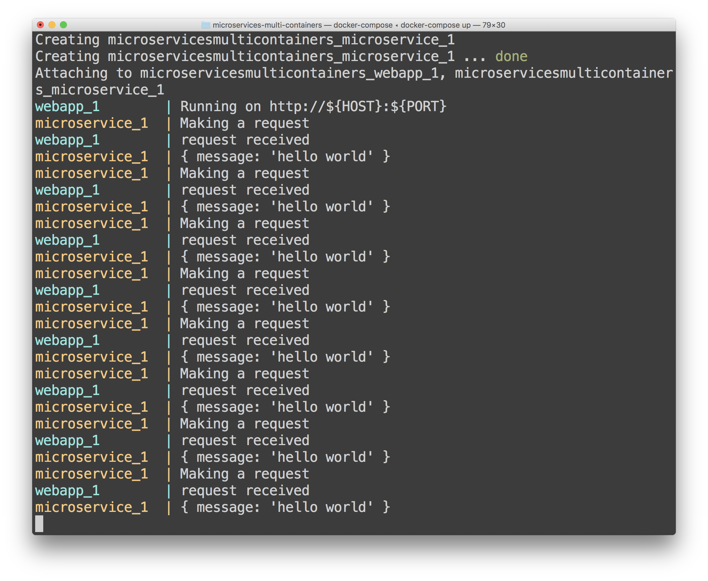

# Two Containers Having a Conversation

Most people understand the idea of container-based application packaging and deployment pretty quickly, but there seemed to be a lack of super-basic tutorials that show how to connect two microservices together without a ton of fluff. 

This repository attempts to satisfy that need. Here's the basic scenario:

1. A REST API that outputs JSON when called.
1. A client app that runs as a microservice that calls the JSON-outputting REST API.

To get this working, you'll need to install [Docker](http://www.docker.com). Then, run the following from your command line:

```
git clone https://github.com/bradygaster/super-basic-microservice-scenario.git
docker-compose up
```

The app should spin up a new pair of containers, on a network. On intervals, the microservice should simply ping the REST API and write out the results. With a little luck you'll see something like this when you run the app. 



Once you're happy that this is working, hit `Ctrl-C` to stop the app, and then type the following command to delete the containers and images. 

```
docker-compose down --rmi all
```

Rinse. Repeat until your app is complete. 